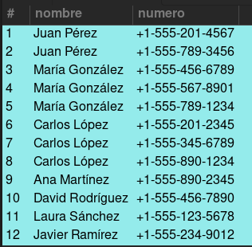

# Solución Taller #4 Consultas, Vistas, Procedimientos y Trigger

Resumen sin imagenes en [README.md](./README.md)

## Primera actividad

En el commit 0639935
modifico el script generador de la librería para que acepte números de ISBN de 13 digitos, ya que el standard se actualizó desde 2008: [about ISBN](https://www.isbn.org/about_ISBN_standard)

Script de poblado de la base de datos: [libreria_populate.sql](./libreria_populate.sql)

5 Consultas a la librería: [libreria_queries.sql](./libreria_queries.sql)

1. El nombre y la fecha de nacimiento de cada escritor

```sql
SELECT
    nombre AS autor, `fecha de nacimiento`
FROM
    autor;
```


2. La cantidad de libros diferentes vendidos

Interpretandolo como que se quiere conocer las ventas de los libros:

```sql
SELECT
    l.ISBN,
    l.titulo,
    l.numero_paginas,
    l.nombre_editorial,
    c.nombre AS `comprado_por`
FROM
    libro_cliente AS lc
        LEFT JOIN
    libro AS l ON ISBN_libro_cliente = ISBN
        LEFT JOIN
    cliente AS c ON id_cliente = cedula;
```


Interpretandolo como el número de veces que se ha vendido cada libro:

```sql
SELECT
    l.ISBN, l.titulo, COUNT(l.ISBN) AS `ejemplares_vendidos`
FROM
    libro_cliente AS lc
        LEFT JOIN
    libro AS l ON ISBN_libro_cliente = ISBN
GROUP BY l.ISBN;
```


3. El nombre de su cliente acompañado de sus numeros teléfonicos

```sql
SELECT
    c.nombre, t.numero
FROM
    cliente AS c
        LEFT JOIN
    telefono_cliente AS t ON c.cedula = t.cedula_cliente;
```



4. El nombre del libro acompañado por su autor o sus autores

```sql
SELECT
    l.ISBN,
    l.titulo,
    l.numero_paginas,
    l.nombre_editorial,
    a.nombre AS autor
FROM
    libro AS l
        LEFT JOIN
    libro_autor AS la ON LA.ISBN_libro = l.ISBN
        LEFT JOIN
    autor AS a ON la.id_autor = a.id;
```


5. El nombre de las editoriales que han logrado vender libros.
```sql
SELECT 
    nombre_editorial, COUNT(ISBN) AS `Libros_vendidos`
FROM
    libro_cliente
        LEFT JOIN
    libro ON ISBN_libro_cliente = ISBN
GROUP BY nombre_editorial;
```


### Vistas realizadas:

Las 2 vistas más relevantes para obtener de esta base de datos son las que otorgan información sobre el negocio, facilitando la toma de desiciónes. Por lo tanto realicé vistas que muestran información relacionada con las ventas y los clientes.

- Libros más vendidos en orden
- Clientes que más libros compraron en orden

Archivo [libreria_views.sql](./libreria_views.sql)

## Segunda actividad

De acuerdo al modelo relacional del hospital, realizo la definición de la base de datos en sql: [hospital_schema.sql](./hospital_schema.sql)

Script de poblado de la db hospital: [hospital_populate.sql](./hospital_populate.sql)

Consultas a la db del hospital: [hospital_queries.sql](./hospital_queries.sql)

### Vistas realizadas:

Las 3 vistas más relevantes que escogí son las que permiten identificar información crítica para el funcionamiento del hospital, tales como:

- Los medicamentos más demandados
- Los pacientes que más facturas pagan
- Los médicos que más procedimientos han realizado.

finalmente agregué una vista general de todos los procedimientos, relacionando los pacientes, médicos y la cantidad de enfermeros involucrados.

Archivo [hispital_views.sql](./hispital_views.sql)

## Tercera actividad

### Stored procedures

Creo los stored procedures para realizar operaciones crud en las db de la librería y el hospital incluyendo ejemplos de su uso con comentarios:

- [libreria_procedures.sql](./libreria_procedures.sql)
- [hospital_procedures.sql](./hospital_procedures.sql)

### Triggers

Creo las tablas `control_de_cambios_librería`, `control_de_cambios_hospital` y los triggers para llenarlas cuando se inserta o se borra una registro:

- [libreria_triggers.sql](./libreria_triggers.sql)
- [hospital_triggers.sql](./hospital_triggers.sql)

## Mejoras al modelo

Solicitando la descripción de cuáles son las reglas del negocio se puede analizar a profundidad el diseño del modelo, sin embargo a simple vista realizo las siguientes sugerencias:

- A un paciente le pueden realizar **varios** procedimientos en lugar de uno solo
- Un procedimiento debe ser realizado por **mínimo un** medico (participación total)
- Ya que los medicamentos tienen un identificador y se relaciona con muchos pacientes, me parece que la relación paciente **solicitar** medicamentos sería más adecuado que "tomar" en el contexto del hospital.
- Medicamentos podría tener un atributo de `cantidad` o "stock".
- Agregar la relación de muchos a muchos **incluir** entre factura y procedimientos con participación total del lado de factura.
- Procedimiento puede tener el atributo `precio`

```

```
